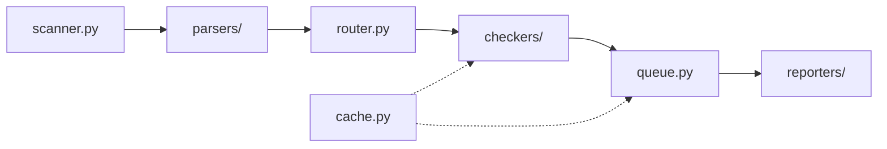

This page walks through how `linksanity scan` turns a set of file paths into a report, for anyone reading the source or considering a contribution.

## How linksanity works

**`scanner.py`** is the entry point for a scan. `run_scan` expands the given patterns — files, directories, or globs — into a deduplicated list of paths, applying the extension filter when a directory is walked (`.md`, `.rst`, `.html`, `.htm`, `.adoc`, `.asciidoc`, `.mdx`, `.ipynb`, `.xml`, `.dbk`). When `--incremental` is set, it narrows that list to files changed since the baseline commit before anything else runs.

**`parsers/`** turns each file into a list of `(url, line)` pairs. The scanner dispatches by extension: `markdown.py` for `.md` (CommonMark, via markdown-it-py), `myst.py` for MyST role syntax (`{doc}`, `{ref}`) as an opt-in second pass over the same `.md` files, `mdx.py` for `.mdx` (CommonMark plus JSX `href`/`to` attributes), `rst.py` for `.rst` (via docutils), `html.py` for `.html`/`.htm` (via BeautifulSoup), `asciidoc.py` for `.adoc`/`.asciidoc` (line-based regex scan), `docbook.py` for `.xml`/`.dbk` (via `xml.parsers.expat`, also collecting `id`/`xml:id` values corpus-wide for `<xref linkend>` resolution), and `notebook.py` for `.ipynb` (markdown cells only, skipping code cells). Every parser preserves line numbers so results can point back at a specific line.

**`router.py`** classifies each URL into a `LinkType` — `ANCHOR`, `INTERNAL`, `EXTERNAL`, `EXTERNAL_ANCHOR`, or `NON_HTTP_SCHEME` — and then routes it to the checker that can resolve it. See "When each checker is chosen" below for the exact rules.

**`checkers/`** do the actual resolution: `filesystem.py` for local paths and anchor fragments, `http.py` for network requests (with retry and redirect handling), and `playwright.py` for links whose domain needs a real browser to render before the link is meaningful (for example, a JS-only single-page app).

**`queue.py`** (`LinkQueue`) sits in the middle of the pipeline: it deduplicates URLs seen across multiple source files so each one is only checked once, tracks every `(source_file, line)` that referenced it, and aggregates the final `LinkResult`s for reporting.

**`cache.py`** is an optional JSON-backed cache of URL to last check result, keyed by URL, that lets a re-run skip network checks for links that haven't expired (`cache_ttl`) — only `EXTERNAL` and `EXTERNAL_ANCHOR` results are cached, since filesystem and anchor checks are already fast and can go stale the moment a local file changes.

**`reporters/`** take the finished result set and format it — console output (Rich) by default, or JSON/CSV/Markdown/GitHub-annotation formats depending on `--format` and related flags.

Separately, **`crawler.py`** implements `linksanity crawl`: instead of scanning local files, it BFS-crawls a live site with Playwright, following same-domain pages and checking external links with `http.py`. It skips `scanner.py`/`parsers/`/`router.py` entirely but reuses the same `LinkQueue`, checkers, and reporters as the scan pipeline.

One accuracy note for anyone touching the fixer: `linksanity fix` (`fixer.py`) only rewrites `.md`, `.rst`, `.html`, and `.htm` files in place, even though the scanner and parsers above cover all 8 formats — links found in `.mdx`, `.adoc`/`.asciidoc`, `.ipynb`, or `.xml`/`.dbk` files are reported but not auto-rewritten.

## Pipeline diagram

## When each checker is chosen

`router.classify` first assigns each URL a type, then `router.dispatch` routes it:

- A URL starting with `#` is an **ANCHOR**. A URL using a scheme that has no fetchable resource (`mailto:`, `tel:`, `javascript:`, `data:`, `blob:`, `ftp:`, `sms:`) is a **NON_HTTP_SCHEME**. An `http(s)://` URL with a fragment is an **EXTERNAL_ANCHOR**; without one it's plain **EXTERNAL**. Everything else — a relative or absolute local path — is **INTERNAL**.
- **NON_HTTP_SCHEME** links are never checked: they're reported as skipped immediately, with no checker invoked.
- **ANCHOR** and **INTERNAL** links always go to the **filesystem checker**, and this happens before any of the rules below — it's checked first, ahead of the offline flag and the skip-pattern list, so a local link is validated even when `--offline` or `--skip-urls` would otherwise suppress a check.
- For the remaining types (**EXTERNAL**, **EXTERNAL_ANCHOR**): if `--offline` is set, the link is skipped without a network call. Otherwise, if the URL matches a configured `--skip-urls` pattern, it's skipped.
- If the link's domain matches one of `config.js_domains` (exactly, or as a subdomain), it goes to the **playwright checker** — this is the only condition that selects Playwright; everything else that reaches this point falls through to HTTP.
- Anything left goes to the **HTTP checker**, bounded by a worker semaphore and using the configured timeout, retry count, and max-redirect limit.

## Contributing

Development setup is a standard editable install: clone the repo, create a virtualenv, and run `pip install -e ".[dev,browser]"` followed by `playwright install chromium` to pull in the browser used by the Playwright checker and crawler. Tests run via `pytest` (or scoped to `tests/unit/`/`tests/integration/`), and both `ruff check linksanity/ tests/ scripts/ --fix` and `mypy linksanity/` must pass before a PR is opened. Full setup, guidelines, and the PR checklist live in [CONTRIBUTING.md](https://github.com/ya8282/linksanity/blob/main/CONTRIBUTING.md).
